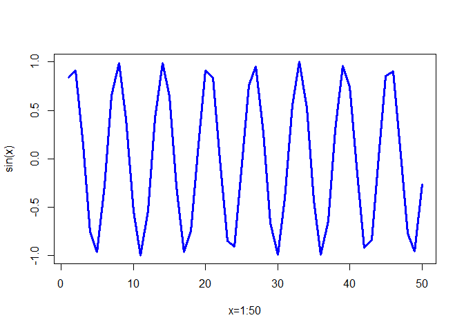

class04
================
Xueran Zou

## Simple Calculations

``` r
2+2
```

    [1] 4

``` r
3^2
```

    [1] 9

``` r
sqrt(25)
```

    [1] 5

``` r
2*(1+1)
```

    [1] 4

``` r
2*1+1
```

    [1] 3

``` r
exp(1)
```

    [1] 2.718282

``` r
log(2.718282)
```

    [1] 1

``` r
log(10, base=10)
```

    [1] 1

``` r
x=1:50
plot(x, sin(x))
```


``` r
plot(x, sin(x), typ="l", col="blue", lwd=3, xlab="x=1:50")
```



## Object Assignment

``` r
x <- 3*4
x
```

    [1] 12

``` r
r_rocks <- 2^3
r_rocks
```

    [1] 8

## Calling Functions

``` r
seq(1,10)
```

     [1]  1  2  3  4  5  6  7  8  9 10

``` r
seq(1,10, by=2)
```

    [1] 1 3 5 7 9

``` r
example(seq)
```


    seq> seq(0, 1, length.out = 11)
     [1] 0.0 0.1 0.2 0.3 0.4 0.5 0.6 0.7 0.8 0.9 1.0

    seq> seq(stats::rnorm(20)) # effectively 'along'
     [1]  1  2  3  4  5  6  7  8  9 10 11 12 13 14 15 16 17 18 19 20

    seq> seq(1, 9, by = 2)     # matches 'end'
    [1] 1 3 5 7 9

    seq> seq(1, 9, by = pi)    # stays below 'end'
    [1] 1.000000 4.141593 7.283185

    seq> seq(1, 6, by = 3)
    [1] 1 4

    seq> seq(1.575, 5.125, by = 0.05)
     [1] 1.575 1.625 1.675 1.725 1.775 1.825 1.875 1.925 1.975 2.025 2.075 2.125
    [13] 2.175 2.225 2.275 2.325 2.375 2.425 2.475 2.525 2.575 2.625 2.675 2.725
    [25] 2.775 2.825 2.875 2.925 2.975 3.025 3.075 3.125 3.175 3.225 3.275 3.325
    [37] 3.375 3.425 3.475 3.525 3.575 3.625 3.675 3.725 3.775 3.825 3.875 3.925
    [49] 3.975 4.025 4.075 4.125 4.175 4.225 4.275 4.325 4.375 4.425 4.475 4.525
    [61] 4.575 4.625 4.675 4.725 4.775 4.825 4.875 4.925 4.975 5.025 5.075 5.125

    seq> seq(17) # same as 1:17, or even better seq_len(17)
     [1]  1  2  3  4  5  6  7  8  9 10 11 12 13 14 15 16 17

``` r
# Some functions don't require arguments
date()
```

    [1] "Fri Jun  9 13:00:57 2023"

## Getting Help In R

``` r
# help(function)
# ?function
# example(function)
```

## Vectors, Vectorization, and Indexing

``` r
length(3.1)
```

    [1] 1

Create longer vectors.

``` r
y <- c(56, 95.3, 0.4)
y
```

    [1] 56.0 95.3  0.4

``` r
z <- c(3.2, 1.1, 0.2)
z
```

    [1] 3.2 1.1 0.2

All elements of a vector must be the same type.

``` r
dbl_var <- c(1, 2.5, 4.5)
dbl_var
```

    [1] 1.0 2.5 4.5

``` r
log_var <- c(TRUE, FALSE, T, F)
log_var
```

    [1]  TRUE FALSE  TRUE FALSE

``` r
chr_var <- c("these are", "some", "strings")
chr_var
```

    [1] "these are" "some"      "strings"  

When you attempt to combine different types they will be coerced to be
the most flexible type.

``` r
var <- c(1, "G", "4", 0.05, TRUE)
var
```

    [1] "1"    "G"    "4"    "0.05" "TRUE"

Name a vector

``` r
m <- c(a=1, b=2, c=3)
m
```

    a b c 
    1 2 3 

``` r
m <- 1:3
names(m) <- c("a", "b", "c")
m[c("b", "a")]
```

    b a 
    2 1 

Vectorization

``` r
y+z
```

    [1] 59.2 96.4  0.6

``` r
y-z
```

    [1] 52.8 94.2  0.2

``` r
y/z
```

    [1] 17.50000 86.63636  2.00000

``` r
sqrt(y)
```

    [1] 7.4833148 9.7621719 0.6324555

``` r
round(sqrt(y), 3)
```

    [1] 7.483 9.762 0.632

``` r
log(y)/2 + 1
```

    [1] 3.0126758 3.2785149 0.5418546

Vector Indexing

``` r
y <- c(56, 95.3, 0.4)

y[2]
```

    [1] 95.3

``` r
y[1]
```

    [1] 56

``` r
y[4]
```

    [1] NA

``` r
y[3]<-0.5
y
```

    [1] 56.0 95.3  0.5

## Data Frame

Create with the function data.frame()

``` r
dat <- data.frame(id=letters[1:10], x=1:10, y=11:20)
```

Read delimited files with the functions read.csv(), read.table(),
read_xlsx()

``` r
df <- read.csv("https://tinyurl.com/UK-foods")

# Show first 6 rows
head(df)
```

                   X England Wales Scotland N.Ireland
    1         Cheese     105   103      103        66
    2  Carcass_meat      245   227      242       267
    3    Other_meat      685   803      750       586
    4           Fish     147   160      122        93
    5 Fats_and_oils      193   235      184       209
    6         Sugars     156   175      147       139

``` r
# Show last 6 rows
tail(df)
```

                       X England Wales Scotland N.Ireland
    12      Fresh_fruit     1102  1137      957       674
    13          Cereals     1472  1582     1462      1494
    14         Beverages      57    73       53        47
    15      Soft_drinks     1374  1256     1572      1506
    16 Alcoholic_drinks      375   475      458       135
    17    Confectionery       54    64       62        41

``` r
dim(df)
```

    [1] 17  5

``` r
nrow(df)
```

    [1] 17

``` r
ncol(df)
```

    [1] 5

``` r
rownames(df)
```

     [1] "1"  "2"  "3"  "4"  "5"  "6"  "7"  "8"  "9"  "10" "11" "12" "13" "14" "15"
    [16] "16" "17"

``` r
colnames(df)
```

    [1] "X"         "England"   "Wales"     "Scotland"  "N.Ireland"

``` r
str(df)
```

    'data.frame':   17 obs. of  5 variables:
     $ X        : chr  "Cheese" "Carcass_meat " "Other_meat " "Fish" ...
     $ England  : int  105 245 685 147 193 156 720 253 488 198 ...
     $ Wales    : int  103 227 803 160 235 175 874 265 570 203 ...
     $ Scotland : int  103 242 750 122 184 147 566 171 418 220 ...
     $ N.Ireland: int  66 267 586 93 209 139 1033 143 355 187 ...
