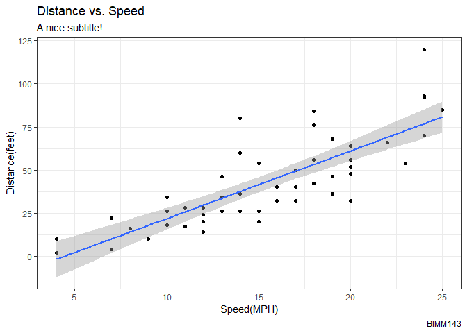
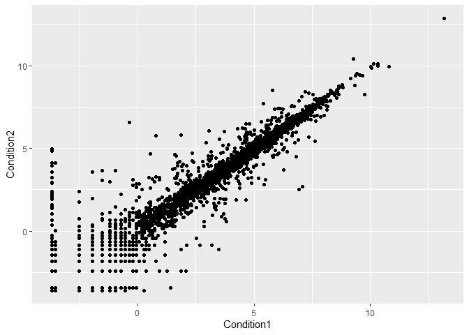

class05
================
Xueran Zou
4/19/23

# Base R Plotting

We are going to start by generating the plot of class 04. This code is
plotting the **cars** dataset.

``` r
plot(cars)
```


**Q1. For which phases is data visualization important in our scientific
workflows?**

Communication of results, EDA and detection of outliers, etc.

**Q2. True or False? The ggplot2 package comes already installed with
R?**

False.

# Ggplot2

First, we need to install the package. We do this by using the
install.packages command.

``` r
# install.packages('ggplot2')
```

After that, we need to load the package.

``` r
library(ggplot2)
```

We are going to build the plot of the cars dataframe by using ggplot.

``` r
ggplot(data = cars)
```


``` r
ggplot(data = cars) + aes(x=speed, y=dist)
```


``` r
ggplot(data = cars) + aes(x=speed, y=dist) + geom_point()
```


``` r
ggplot(data = cars) + aes(x=speed, y=dist) + geom_point() + geom_smooth(method = 'lm')
```

    `geom_smooth()` using formula = 'y ~ x'


``` r
ggplot(data = cars) + aes(x=speed, y=dist) + geom_point() + geom_smooth(method = 'lm') + labs(title = 'Distance vs. Speed', subtitle = 'A nice subtitle!', caption = 'BIMM143', x = 'Speed(MPH)', y = 'Distance(feet)') + theme_bw()
```

    `geom_smooth()` using formula = 'y ~ x'



**Q3. Which plot types are typically NOT used to compare distributions
of numeric variables?**

Network graphs.

**Q4. Which statement about data visualization with ggplot2 is
incorrect?**

ggplot2 is the only way to create plots in R.

**Q5. Which geometric layer should be used to create scatter plots in
ggplot2?**

geom_point()

**Q6. In your own RStudio can you add a trend line layer to help show
the relationship between the plot variables with the geom_smooth
function?**

Yes.

**Q7. Argue with geom_smooth() to add a straight line from a linear
model without the shaded standard error region?**

add geom_smooth(method = ‘lm’)

**Q8. Can you finish this plot by adding various label annotations with
the labs() function and changing the plot look to a more conservative
“black & white” theme by adding the theme_bw function?**

Yes.

# Plotting expression data

Loading the data from the URL.

``` r
url <- "https://bioboot.github.io/bimm143_S20/class-material/up_down_expression.txt"
genes <- read.delim(url)
head(genes)
```

            Gene Condition1 Condition2      State
    1      A4GNT -3.6808610 -3.4401355 unchanging
    2       AAAS  4.5479580  4.3864126 unchanging
    3      AASDH  3.7190695  3.4787276 unchanging
    4       AATF  5.0784720  5.0151916 unchanging
    5       AATK  0.4711421  0.5598642 unchanging
    6 AB015752.4 -3.6808610 -3.5921390 unchanging

Initial ggplot.

``` r
ggplot(data = genes) + aes(x=Condition1, y=Condition2) + geom_point() 
```



``` r
nrow(genes)
```

    [1] 5196

``` r
ncol(genes)
```

    [1] 4

``` r
colnames(genes)
```

    [1] "Gene"       "Condition1" "Condition2" "State"     

``` r
table(genes[,'State'])
```


          down unchanging         up 
            72       4997        127 

``` r
(table(genes[,'State']) / nrow(genes)) * 100
```


          down unchanging         up 
      1.385681  96.170131   2.444188 

**Q9.** 5196

**Q10.** 4

**Q11.** 127

**Q12.** 2.44%

Adding color to the plot.

``` r
p1 <- ggplot(data = genes) + aes(x=Condition1, y=Condition2, col=State) + geom_point()
p1
```


Let’s change the color theme

``` r
p2 <- p1 + scale_color_manual(values = c("blue", "grey", "red"))
p2
```


Let’s add some labels.

``` r
p2 + labs(title = 'Differential gene expression', x = 'Control (no drug)', y = 'Drug Treatment')
```


# Optional extensions

Loading the dataset gapmider from the URL

``` r
# File location online
url <- "https://raw.githubusercontent.com/jennybc/gapminder/master/inst/extdata/gapminder.tsv"
gapminder <- read.delim(url)
```

Install package dplyr. Focus in on a single year, 2007.

``` r
# install.packages("dplyr")  ## un-comment to install if needed
library(dplyr)
```


    Attaching package: 'dplyr'

    The following objects are masked from 'package:stats':

        filter, lag

    The following objects are masked from 'package:base':

        intersect, setdiff, setequal, union

``` r
gapminder_2007 <- gapminder %>% filter(year==2007)
```

Let’s consider the `gapminder_2007` dataset which contains the variables
GDP per capita `gdpPercap` and life expectancy `lifeExp` for 142
countries in the year 2007

``` r
ggplot(gapminder_2007) + aes(x=gdpPercap, y=lifeExp) + geom_point()
```


Make the points slightly transparent

``` r
ggplot(gapminder_2007) + aes(x=gdpPercap, y=lifeExp) + geom_point(alpha=0.4)
```


Add more variables like continent and population (pop)

``` r
ggplot(gapminder_2007) + aes(x=gdpPercap, y=lifeExp, color=continent, size=pop) + geom_point(alpha=0.4)
```


Let’s see how the plot looks like if we color the points by the numeric
variable population pop:

``` r
ggplot(gapminder_2007) + aes(x=gdpPercap, y=lifeExp, color=pop) + geom_point(alpha=0.8)
```


Adjust point size

``` r
ggplot(gapminder_2007) + 
  aes(x=gdpPercap, y=lifeExp, size=pop) +
  geom_point(alpha=0.5)
```


To reflect the actual population differences by the point size, we can
use the scale_size_area() function.

``` r
ggplot(gapminder_2007) + 
  geom_point(aes(x=gdpPercap, y=lifeExp,
                 size = pop), alpha=0.5) + 
  scale_size_area(max_size=10)
```


**Produce my 1957 plot**

``` r
# File location online
url <- "https://raw.githubusercontent.com/jennybc/gapminder/master/inst/extdata/gapminder.tsv"
gapminder <- read.delim(url)

# Filter the gapminder to include only the year 1957 and save the result as gapminder_1957
library(dplyr)
gapminder_1957 <- gapminder %>% filter(year==1957)

# Make a plot
# Create a scatter plot
# Use the color aesthetic to indicate each continent by a different color
# Use the size aesthetic to adjust the point size by the population pop
# Use scale_size_area() so that the point sizes reflect the actual population differences and set the max_size of each point to 15 -Set the opacity/transparency of each point to 70% using the alpha=0.7 parameter
ggplot(gapminder_1957) + aes(x=gdpPercap, y=lifeExp, color=continent, size=pop) + geom_point(alpha=0.7) + scale_size_area(max_size=15)
```


Include 1957 and 2007 in the plot

``` r
gapminder_1957 <- gapminder %>% filter(year==1957 | year==2007)
ggplot(gapminder_1957) + geom_point(aes(x=gdpPercap, y=lifeExp, color=continent, size=pop,), alpha=0.7) + scale_size_area(max_size = 10) + facet_wrap(~year)
```


## Bar Chart

Creat a bar chart with the gapminder_top5. It contains population (in
millions) and life expectancy data for the biggest countries by
population in 2007.

``` r
# File location online
url <- "https://raw.githubusercontent.com/jennybc/gapminder/master/inst/extdata/gapminder.tsv"
gapminder <- read.delim(url)

# Filter the gapminder to include only the year 1957 and save the result as gapminder_1957
library(dplyr)
gapminder_top5 <- gapminder %>% filter(year==2007) %>% arrange(desc(pop)) %>% top_n(5, pop)
gapminder_top5
```

            country continent year lifeExp        pop gdpPercap
    1         China      Asia 2007  72.961 1318683096  4959.115
    2         India      Asia 2007  64.698 1110396331  2452.210
    3 United States  Americas 2007  78.242  301139947 42951.653
    4     Indonesia      Asia 2007  70.650  223547000  3540.652
    5        Brazil  Americas 2007  72.390  190010647  9065.801

``` r
ggplot(gapminder_top5) + geom_col(aes(x = country, y = pop))
```


Fill bars with color

``` r
ggplot(gapminder_top5) + geom_col(aes(x = country, y = pop, fill = continent))
```


See what happens if we use a numeric variable like life expectancy
lifeExp instead of the categorical variable continent.

``` r
ggplot(gapminder_top5) +geom_col(aes(x = country, y = pop, fill = lifeExp))
```


Plot population size by country. Use the GDP per capita gdpPercap as
fill aesthetic

``` r
ggplot(gapminder_top5) + geom_col(aes(x = country, y = pop, fill = gdpPercap))
```


Change the order of the bars

``` r
ggplot(gapminder_top5) + geom_col(aes(x = reorder(country, -pop), y = pop, fill = gdpPercap))
```


Fill by counrty

``` r
ggplot(gapminder_top5) + aes(x = reorder(country, -pop), y = pop, fill = country) + geom_col(col="gray30") + guides(fill = "none")
```


