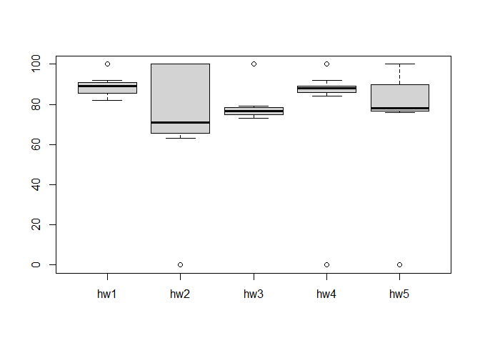

Class 6: R functions
================
Xueran Zou

Develop our own R function to calculate average grades in a fictional
class.

We will start with a simplified version of the problem, just calculating
the average grade of one student.

# Simplified version

``` r
# Example input vectors to start with
student1 <- c(100, 100, 100, 100, 100, 100, 100, 90)
student2 <- c(100, NA, 90, 90, 90, 90, 97, 80)
student3 <- c(90, NA, NA, NA, NA, NA, NA, NA)
```

We are going to start by calculating the average score of the homeworks.

``` r
mean(student1)
```

    [1] 98.75

To get the minimum score we can use which.min.

``` r
student1
```

    [1] 100 100 100 100 100 100 100  90

``` r
which.min(student1)
```

    [1] 8

I can do the average of the first 7 homework scores:

``` r
mean(student1[1:7])
```

    [1] 100

Another way to select the first 7 homeworks:

``` r
student1[1:7]
```

    [1] 100 100 100 100 100 100 100

``` r
# remove the eighth homework from the student1
student1[-8]
```

    [1] 100 100 100 100 100 100 100

Another way to drop the lowest score:

``` r
student1_drop_lowest = student1[-which.min(student1)]
student1_drop_lowest
```

    [1] 100 100 100 100 100 100 100

I can get the mean of the homework scores after dropping the lowest
score by doing:

``` r
mean(student1_drop_lowest)
```

    [1] 100

We have our first working snippet of code!

Let’s try to generalize it to student2:

``` r
student2 <- c(100, NA, 90, 90, 90, 90, 97, 80)
student2
```

    [1] 100  NA  90  90  90  90  97  80

``` r
student2_drop_lowest = student2[-which.min(student2)]
student2_drop_lowest
```

    [1] 100  NA  90  90  90  90  97

There is a way to calculate the mean dropping missing values (or NA).

``` r
student2 <- c(100, NA, 90, 90, 90, 90, 97, 80)
mean(student2, na.rm = TRUE)
```

    [1] 91

This looks good for student2. However, for student3:

``` r
student3 <- c(90, NA, NA, NA, NA, NA, NA, NA)
mean(student3, na.rm = TRUE)
```

    [1] 90

We want to know the position of the NAs. So, for student2, we can use
the following:

``` r
student2 <- c(100, NA, 90, 90, 90, 90, 97, 80)
which(is.na(student2))
```

    [1] 2

For student3:

``` r
student3 <- c(90, NA, NA, NA, NA, NA, NA, NA)
which(is.na(student3))
```

    [1] 2 3 4 5 6 7 8

For considering the missing values, we can mask the NA with zeros.

``` r
student2 <- c(100, NA, 90, 90, 90, 90, 97, 80)
student2
```

    [1] 100  NA  90  90  90  90  97  80

``` r
which(is.na(student2))
```

    [1] 2

``` r
student2[is.na(student2)] <- 0
student2
```

    [1] 100   0  90  90  90  90  97  80

``` r
student3[is.na(student3)] <- 0
student3
```

    [1] 90  0  0  0  0  0  0  0

This is going to be our working snippet of code for all students (with
and without NA values)

``` r
student3 <- c(90, NA, NA, NA, NA, NA, NA, NA)
student3[is.na(student3)] <- 0
student3_drop_lowest <- student3[-which.min(student3)]
mean(student3_drop_lowest)
```

    [1] 12.85714

Let’s build a function now.

``` r
x <- c(100, 100, 90, NA)
x[is.na(x)] <- 0
x_drop_lowest <- x[-which.min(student3)]
mean(x_drop_lowest)
```

    [1] 63.33333

We can write it as a function:

``` r
#' Calculate the average score for a vector of homework scores, dropping the lowest score, and considering values as zeroes.
#'
#' @param x A numeric vector of homework scores
#'
#' @return The average values of homework scores
#' @export
#'
#' @examples
grade <- function(x){
    # Mask NA values with zeros
    x[is.na(x)] <- 0
    # Drop the lowest score
    x_drop_lowest <- x[-which.min(x)]
    # Calculate the average scores
    mean(x_drop_lowest)
}
```

Let’s apply the function:

``` r
student1 <- c(100, 100, 100, 100, 100, 100, 100, 90)
student2 <- c(100, NA, 90, 90, 90, 90, 97, 80)
student3 <- c(90, NA, NA, NA, NA, NA, NA, NA)

grade(student1)
```

    [1] 100

``` r
grade(student2)
```

    [1] 91

``` r
grade(student3)
```

    [1] 12.85714

Let’s apply our function to a gradebook from this URL:
https://tinyurl.com/gradeinput

``` r
url <- 'https://tinyurl.com/gradeinput'
gradebook <- read.csv(url, row.names = 1)
```

Let’s apply my function grade to the gradebook using apply() and running
it by rows using MARGIN=1.

``` r
apply(gradebook, 1, grade)
```

     student-1  student-2  student-3  student-4  student-5  student-6  student-7 
         91.75      82.50      84.25      84.25      88.25      89.00      94.00 
     student-8  student-9 student-10 student-11 student-12 student-13 student-14 
         93.75      87.75      79.00      86.00      91.75      92.25      87.75 
    student-15 student-16 student-17 student-18 student-19 student-20 
         78.75      89.50      88.00      94.50      82.75      82.75 

### Q2. Using your grade() function and the supplied gradebook, Who is the top scoring student

overall in the gradebook?

``` r
which.max(apply(gradebook, 1, grade))
```

    student-18 
            18 

``` r
max(apply(gradebook, 1, grade))
```

    [1] 94.5

The student getting the maximum overall score was student 18.

### Q3. From your analysis of the gradebook, which homework was toughest on students (i.e. obtained the lowest scores overall)?

First, we are going to mask NA values with zeros

``` r
gradebook[is.na(gradebook)] <- 0
```

Now, we apply the mean function to the gradebook.

``` r
apply(gradebook, 2, mean)
```

      hw1   hw2   hw3   hw4   hw5 
    89.00 72.80 80.80 85.15 79.25 

The toughest homework will be hw2 considering the mean, and considering
missing homework as 0.

Maybe having zeros for missing homework is too strict and is not a good
representation of the homework difficulty.

One thing we can do is remove the missing values.

``` r
apply(gradebook, 2, mean, na.rm = TRUE)
```

      hw1   hw2   hw3   hw4   hw5 
    89.00 72.80 80.80 85.15 79.25 

If we directly don’t consider the missing values, the toughest homework
will be hw3(according to the mean).

If we use the median instead of the mean as a measure of overall score.

``` r
apply(gradebook, 2, median, na.rm = TRUE)
```

     hw1  hw2  hw3  hw4  hw5 
    89.0 71.0 76.5 88.0 78.0 

Therefore, hw2 will be the toughest according to the median.

If we use some plots:

``` r
boxplot(gradebook)
```



### Q4. From your analysis of the gradebook, which homework was most predictive of overall score (i.e. highest correlation with average grade score)?

``` r
overall_grade = apply(gradebook, 1, grade)
overall_grade
```

     student-1  student-2  student-3  student-4  student-5  student-6  student-7 
         91.75      82.50      84.25      84.25      88.25      89.00      94.00 
     student-8  student-9 student-10 student-11 student-12 student-13 student-14 
         93.75      87.75      79.00      86.00      91.75      92.25      87.75 
    student-15 student-16 student-17 student-18 student-19 student-20 
         78.75      89.50      88.00      94.50      82.75      82.75 

``` r
cor(gradebook$hw1, overall_grade)
```

    [1] 0.4250204

``` r
gradebook[is.na(gradebook)] <- 0
apply(gradebook, 2, cor, y = overall_grade)
```

          hw1       hw2       hw3       hw4       hw5 
    0.4250204 0.1767780 0.3042561 0.3810884 0.6325982 

Therefore, hw5 was the most predictive of overall score.
