class07_machine_learning
================
Xueran Zou

## Example of K-means clustering

The first step is to make up some data with a known structure, so we
know what the answer should be.

``` r
tmp <- c(rnorm(30, mean = -3), rnorm(30, mean = 3))
x <- cbind(x = tmp, y = rev(tmp))
plot(x)
```

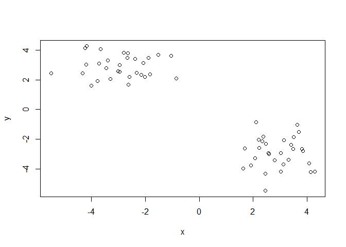

Now we have some structured data in x. Let’s see if K-means is able to
identify the two groups.

``` r
k <- kmeans(x, centers = 2, nstart = 20)
k
```

    K-means clustering with 2 clusters of sizes 30, 30

    Cluster means:
              x         y
    1  2.908490 -2.927923
    2 -2.927923  2.908490

    Clustering vector:
     [1] 2 2 2 2 2 2 2 2 2 2 2 2 2 2 2 2 2 2 2 2 2 2 2 2 2 2 2 2 2 2 1 1 1 1 1 1 1 1
    [39] 1 1 1 1 1 1 1 1 1 1 1 1 1 1 1 1 1 1 1 1 1 1

    Within cluster sum of squares by cluster:
    [1] 48.94855 48.94855
     (between_SS / total_SS =  91.3 %)

    Available components:

    [1] "cluster"      "centers"      "totss"        "withinss"     "tot.withinss"
    [6] "betweenss"    "size"         "iter"         "ifault"      

Let’s explore k.

``` r
k$size
```

    [1] 30 30

``` r
k$centers
```

              x         y
    1  2.908490 -2.927923
    2 -2.927923  2.908490

``` r
k$cluster
```

     [1] 2 2 2 2 2 2 2 2 2 2 2 2 2 2 2 2 2 2 2 2 2 2 2 2 2 2 2 2 2 2 1 1 1 1 1 1 1 1
    [39] 1 1 1 1 1 1 1 1 1 1 1 1 1 1 1 1 1 1 1 1 1 1

``` r
plot(x, col = k$cluster)
```

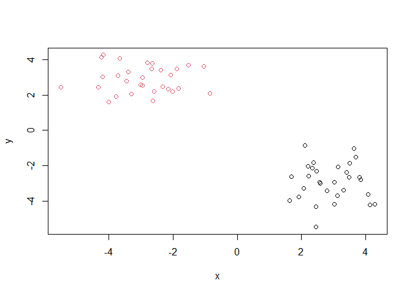

Now we can add the clusters centers:

``` r
plot(x, col = k$cluster)
points(k$centers, col = 'blue', pch = 15)
```

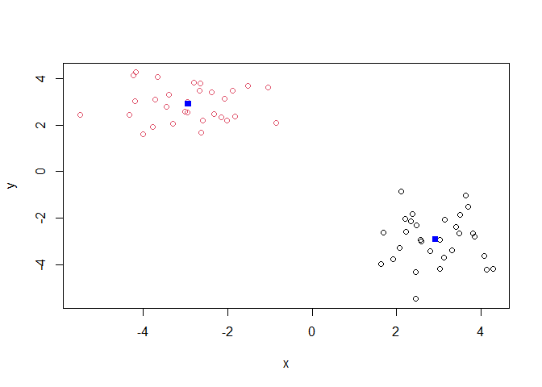

An example when we select the wrong number of clusters for k-means

``` r
k_3 <- kmeans(x, centers = 3, nstart = 20)
plot(x, col = k_3$cluster)
```

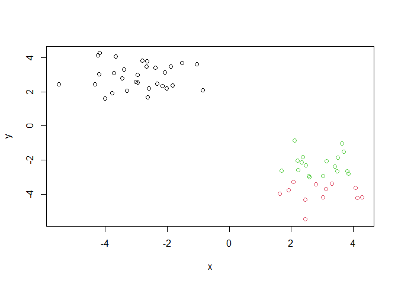

## Example of Hierarchical Clustering

Let’s use the same data as before, which we stored in “x”. We will use
the “hclust()’ function.

``` r
clustering <- hclust(dist(x))
clustering
```


    Call:
    hclust(d = dist(x))

    Cluster method   : complete 
    Distance         : euclidean 
    Number of objects: 60 

``` r
plot(clustering)
```

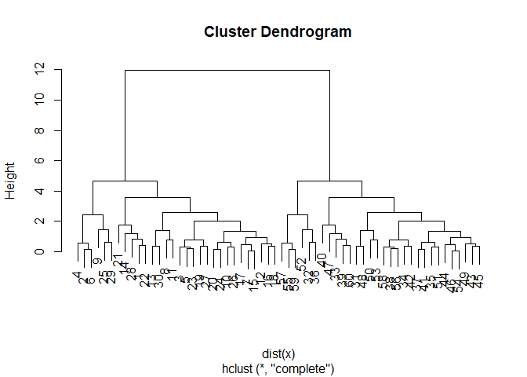

Let’s add a horizontal line

``` r
plot(clustering)
abline(h = 10, col = 'pink')
```

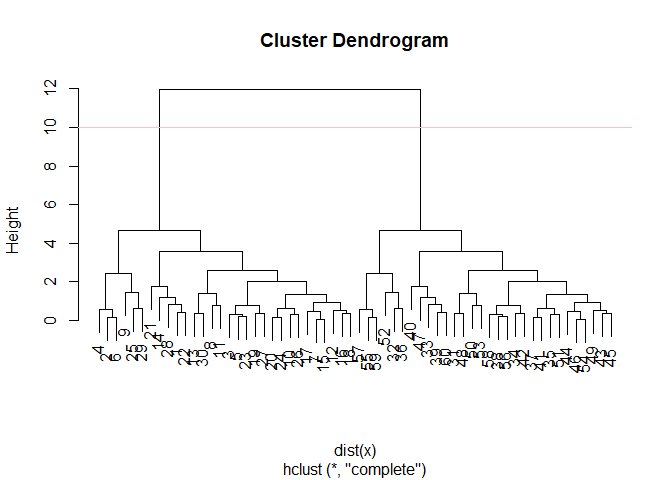

To get our results (i.e., membership vector) we need to “cut” the tree.
The function for doing that is cutree()

``` r
subgroups <- cutree(clustering, h = 20)
subgroups
```

     [1] 1 1 1 1 1 1 1 1 1 1 1 1 1 1 1 1 1 1 1 1 1 1 1 1 1 1 1 1 1 1 1 1 1 1 1 1 1 1
    [39] 1 1 1 1 1 1 1 1 1 1 1 1 1 1 1 1 1 1 1 1 1 1

Plot this:

``` r
plot(x, col = subgroups)
```


You can also “cut” your tree with the number of clusters you want:

``` r
cutree(clustering, k = 2)
```

     [1] 1 1 1 1 1 1 1 1 1 1 1 1 1 1 1 1 1 1 1 1 1 1 1 1 1 1 1 1 1 1 2 2 2 2 2 2 2 2
    [39] 2 2 2 2 2 2 2 2 2 2 2 2 2 2 2 2 2 2 2 2 2 2

# Principal Component Analysis (PCA)

Data import

``` r
url <- "https://tinyurl.com/UK-foods"
x <- read.csv(url)
head(x)
```

                   X England Wales Scotland N.Ireland
    1         Cheese     105   103      103        66
    2  Carcass_meat      245   227      242       267
    3    Other_meat      685   803      750       586
    4           Fish     147   160      122        93
    5 Fats_and_oils      193   235      184       209
    6         Sugars     156   175      147       139

**Q1**. How many rows and columns are in your new data frame named `x`?
What R functions could you use to answer this questions?

``` r
dim(x)
```

    [1] 17  5

``` r
x <- read.csv(url, row.names = 1)
head(x)
```

                   England Wales Scotland N.Ireland
    Cheese             105   103      103        66
    Carcass_meat       245   227      242       267
    Other_meat         685   803      750       586
    Fish               147   160      122        93
    Fats_and_oils      193   235      184       209
    Sugars             156   175      147       139

**Q2.** Which approach to solving the ‘row-names problem’ mentioned
above do you prefer and why? Is one approach more robust than another
under certain circumstances?

Using argument setting row.names=1 can be more robust. Because when
running the first approach (x \<- x\[,-1\]) multiple times, it will
constantly remove the first column of the data frame.

Now we can generate some basic visualizations

**Q3**: Changing what optional argument in the above **barplot()**
function results in the following plot?

``` r
barplot(as.matrix(x), col = rainbow(nrow(x)))
```


Let’s refine out barplot.

``` r
barplot(as.matrix(x), col = rainbow(nrow(x)), beside = TRUE)
```


**Q5**: Generating all pairwise plots may help somewhat. Can you make
sense of the following code and resulting figure? What does it mean if a
given point lies on the diagonal for a given plot?

Other visualization that can be useful:

``` r
pairs(x, col = rainbow(nrow(x)), pch = 15)
```

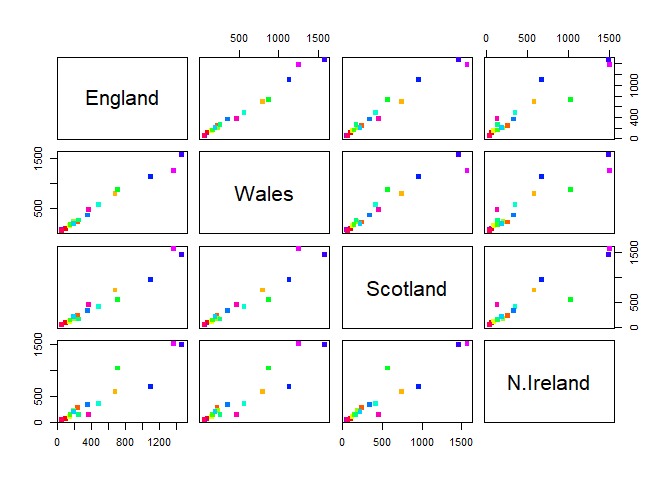

**Q6**. What is the main differences between N. Ireland and the other
countries of the UK in terms of this data-set?

N. Ireland takes less cheese, fish, fresh vegetables, fresh fruit and
alcoholic drinks than the other countries, while it takes more fresh
potatoes.

Let’s apply PCA (Principal Component Analysis). For that, we need to use
the command prcomp(). This function expects the transpose of our data.

``` r
pca <- prcomp(t(x))
summary(pca)
```

    Importance of components:
                                PC1      PC2      PC3       PC4
    Standard deviation     324.1502 212.7478 73.87622 4.189e-14
    Proportion of Variance   0.6744   0.2905  0.03503 0.000e+00
    Cumulative Proportion    0.6744   0.9650  1.00000 1.000e+00

Let’s plot the PCA results:

``` r
plot(pca)
```

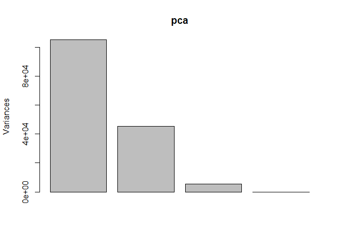

We need to access the results of the PCA.

``` r
attributes(pca)
```

    $names
    [1] "sdev"     "rotation" "center"   "scale"    "x"       

    $class
    [1] "prcomp"

We can explore the pca\$x dataframe:

``` r
pca$x
```

                     PC1         PC2         PC3           PC4
    England   -144.99315    2.532999 -105.768945  2.842865e-14
    Wales     -240.52915  224.646925   56.475555  7.804382e-13
    Scotland   -91.86934 -286.081786   44.415495 -9.614462e-13
    N.Ireland  477.39164   58.901862    4.877895  1.448078e-13

Plot:

``` r
plot(x = pca$x[,1], y = pca$x[,2])
```

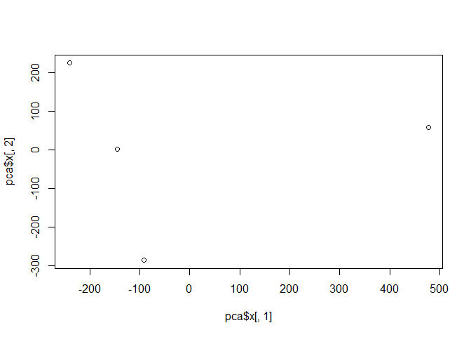

**Q7**. Complete the code below to generate a plot of PC1 vs PC2. The
second line adds text labels over the data points.

``` r
plot(pca$x[,1], pca$x[,2], xlab="PC1", ylab="PC2", xlim=c(-270,500))
text(pca$x[,1], pca$x[,2], colnames(x))
```


**Q8.** Customize your plot so that the colors of the country names
match the colors in our UK and Ireland map and table at start of this
document.

``` r
plot(x = pca$x[,1], y = pca$x[,2])
colors_countries <- c('orange', 'pink', 'blue', 'green')
text(x = pca$x[,1], y = pca$x[,2], colnames(x), col = colors_countries)
```

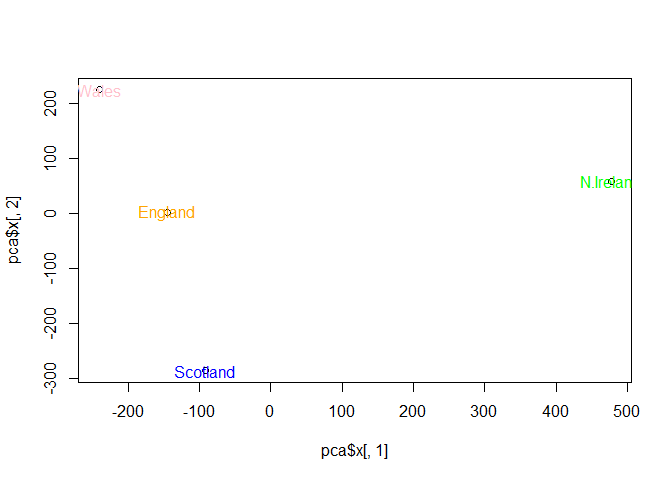

Calculate how much variation in the original data each PC accounts for.

``` r
v <- round( pca$sdev^2/sum(pca$sdev^2) * 100 )
v
```

    [1] 67 29  4  0

``` r
z <- summary(pca)
z$importance
```

                                 PC1       PC2      PC3          PC4
    Standard deviation     324.15019 212.74780 73.87622 4.188568e-14
    Proportion of Variance   0.67444   0.29052  0.03503 0.000000e+00
    Cumulative Proportion    0.67444   0.96497  1.00000 1.000000e+00

``` r
barplot(v, xlab="Principal Component", ylab="Percent Variation")
```


``` r
# Lets focus on PC1 as it accounts for > 90% of variance 
par(mar=c(10, 3, 0.35, 0))
barplot( pca$rotation[,1], las=2 )
```


**Q9**: Generate a similar ‘loadings plot’ for PC2. What two food groups
feature prominantely and what does PC2 maninly tell us about?

``` r
par(mar=c(10, 3, 0.35, 0))
barplot( pca$rotation[,2], las=2 )
```

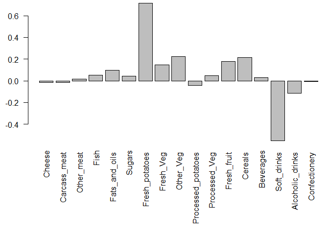

## PCA of RNA-seq data

First step as always is loading the data:

``` r
url2 <- "https://tinyurl.com/expression-CSV"
rna.data <- read.csv(url2, row.names=1)
head(rna.data)
```

           wt1 wt2  wt3  wt4 wt5 ko1 ko2 ko3 ko4 ko5
    gene1  439 458  408  429 420  90  88  86  90  93
    gene2  219 200  204  210 187 427 423 434 433 426
    gene3 1006 989 1030 1017 973 252 237 238 226 210
    gene4  783 792  829  856 760 849 856 835 885 894
    gene5  181 249  204  244 225 277 305 272 270 279
    gene6  460 502  491  491 493 612 594 577 618 638

**Q10**: How many genes and samples are in this data set?

``` r
dim(rna.data)
```

    [1] 100  10

There are 100 genes and 10 samples in this data set.

Let’s apply PCA:

``` r
pca <- prcomp(t(rna.data), scale=TRUE)
summary(pca)
```

    Importance of components:
                              PC1    PC2     PC3     PC4     PC5     PC6     PC7
    Standard deviation     9.6237 1.5198 1.05787 1.05203 0.88062 0.82545 0.80111
    Proportion of Variance 0.9262 0.0231 0.01119 0.01107 0.00775 0.00681 0.00642
    Cumulative Proportion  0.9262 0.9493 0.96045 0.97152 0.97928 0.98609 0.99251
                               PC8     PC9      PC10
    Standard deviation     0.62065 0.60342 3.348e-15
    Proportion of Variance 0.00385 0.00364 0.000e+00
    Cumulative Proportion  0.99636 1.00000 1.000e+00

``` r
plot(pca, main="Quick scree plot")
```


``` r
# Variance captured per PC 
pca.var <- pca$sdev^2

# Percent variance is often more informative to look at 
pca.var.per <- round(pca.var/sum(pca.var)*100, 1)
pca.var.per
```

     [1] 92.6  2.3  1.1  1.1  0.8  0.7  0.6  0.4  0.4  0.0

``` r
barplot(pca.var.per, main="Scree Plot", 
        names.arg = paste0("PC", 1:10),
        xlab="Principal Component", ylab="Percent Variation")
```

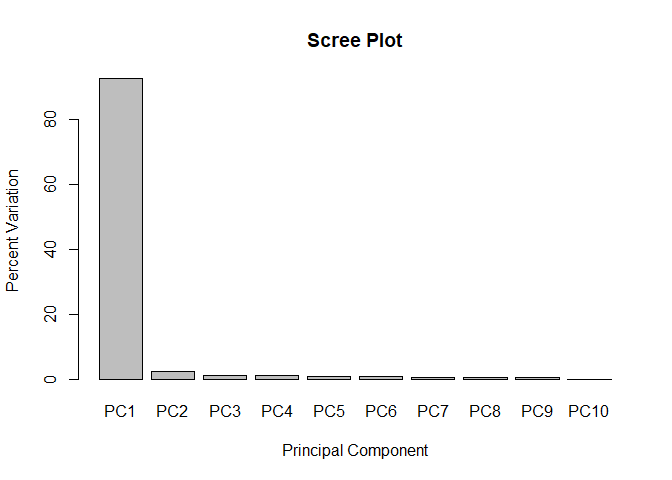

Let’s plot the principal components 1 and 2.

``` r
plot(pca$x[,1], pca$x[,2], xlab = 'PC1', ylab = 'PC2')
```


``` r
colnames(rna.data)
```

     [1] "wt1" "wt2" "wt3" "wt4" "wt5" "ko1" "ko2" "ko3" "ko4" "ko5"

``` r
cols_samples <- c(rep('blue', 5), rep('red', 5))
cols_samples
```

     [1] "blue" "blue" "blue" "blue" "blue" "red"  "red"  "red"  "red"  "red" 

``` r
plot(pca$x[,1], pca$x[,2], xlab = 'PC1', ylab = 'PC2', col = cols_samples)
```

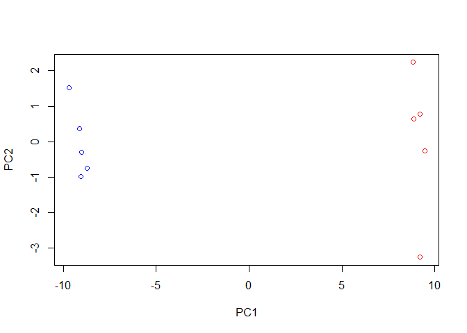

``` r
barplot(pca$rotation[,1])
```

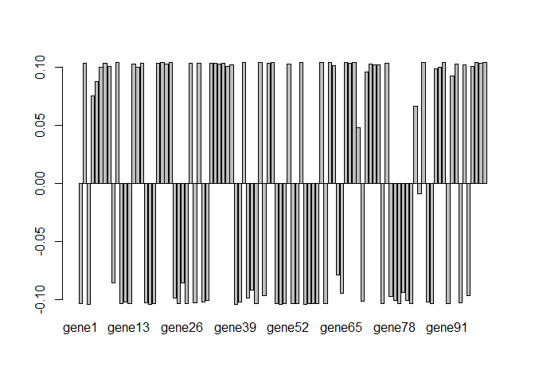

``` r
sort(pca$rotation[,1])
```

          gene56       gene18        gene3       gene39       gene50       gene11 
    -0.103783479 -0.103774699 -0.103761385 -0.103744482 -0.103743341 -0.103719665 
          gene57       gene91        gene1       gene79       gene59       gene75 
    -0.103703675 -0.103698408 -0.103666005 -0.103639415 -0.103607438 -0.103592371 
          gene54       gene44       gene58       gene82       gene87       gene13 
    -0.103584153 -0.103504699 -0.103503980 -0.103481127 -0.103448562 -0.103399591 
          gene19       gene27       gene61       gene25       gene51       gene53 
    -0.103390599 -0.103374849 -0.103308945 -0.103302326 -0.103265591 -0.103245619 
          gene49       gene17       gene29       gene94       gene86       gene40 
    -0.103188532 -0.103013773 -0.102739689 -0.102692869 -0.102122719 -0.102003831 
          gene12       gene31       gene70       gene32       gene81       gene78 
    -0.102001924 -0.101768804 -0.101365212 -0.100677376 -0.100659777 -0.100499426 
          gene42       gene24       gene77       gene96       gene46       gene65 
    -0.098746675 -0.098284250 -0.097473626 -0.096658194 -0.096571619 -0.094219475 
          gene80       gene43       gene26        gene9       gene64       gene84 
    -0.093476477 -0.092001819 -0.085745836 -0.085460936 -0.078643996 -0.009263882 
          gene69       gene83        gene4        gene5       gene92       gene71 
     0.048197107  0.066065263  0.075320862  0.087428334  0.092534408  0.095664760 
          gene88        gene6       gene15       gene89       gene37        gene8 
     0.098226585  0.099670829  0.099993193  0.100038548  0.100467583  0.100759370 
          gene97       gene63       gene74       gene73       gene38       gene95 
     0.100787961  0.101468649  0.101747637  0.102001050  0.102080752  0.102142492 
          gene72       gene35       gene14       gene52       gene22       gene93 
     0.102347342  0.102382706  0.102478762  0.102519795  0.102725125  0.102950950 
          gene30       gene20       gene36       gene67       gene47       gene76 
     0.103044435  0.103121803  0.103412422  0.103453646  0.103502386  0.103514464 
           gene2       gene34       gene33       gene16        gene7       gene28 
     0.103514749  0.103525731  0.103592988  0.103598474  0.103609009  0.103638752 
          gene99       gene23       gene48       gene55       gene85       gene62 
     0.103649598  0.103681565  0.103682769  0.103695870  0.103698370  0.103713893 
          gene41       gene90       gene10       gene21       gene60       gene98 
     0.103716818  0.103777744  0.103783379  0.103787935  0.103805515  0.103837190 
          gene68       gene45       gene66      gene100 
     0.103839510  0.103840183  0.103845454  0.103870820 

## Using ggplot

``` r
library(ggplot2)

df <- as.data.frame(pca$x)

ggplot(df) +
  aes(PC1, PC2) +
  geom_point()
```


Make it nicer.

``` r
df$samples <- colnames(rna.data) 
df$condition <- substr(colnames(rna.data),1,2)

p <- ggplot(df) + 
        aes(PC1, PC2, label=samples, col=condition) + 
        geom_label(show.legend = FALSE)
p
```


``` r
p + labs(title="PCA of RNASeq Data",
       subtitle = "PC1 clealy seperates wild-type from knock-out samples",
       x=paste0("PC1 (", pca.var.per[1], "%)"),
       y=paste0("PC2 (", pca.var.per[2], "%)"),
       caption="Class example data") +
     theme_bw()
```

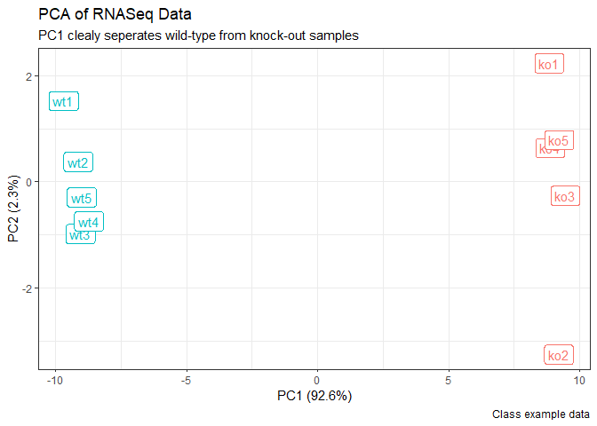

## Gene loadings

Find the top 10 measurements (genes) that contribute most to PC1 in
either direction.

``` r
loading_scores <- pca$rotation[,1]

## Find the top 10 measurements (genes) that contribute
## most to PC1 in either direction (+ or -)
gene_scores <- abs(loading_scores) 
gene_score_ranked <- sort(gene_scores, decreasing=TRUE)

## show the names of the top 10 genes
top_10_genes <- names(gene_score_ranked[1:10])
top_10_genes 
```

     [1] "gene100" "gene66"  "gene45"  "gene68"  "gene98"  "gene60"  "gene21" 
     [8] "gene56"  "gene10"  "gene90" 
