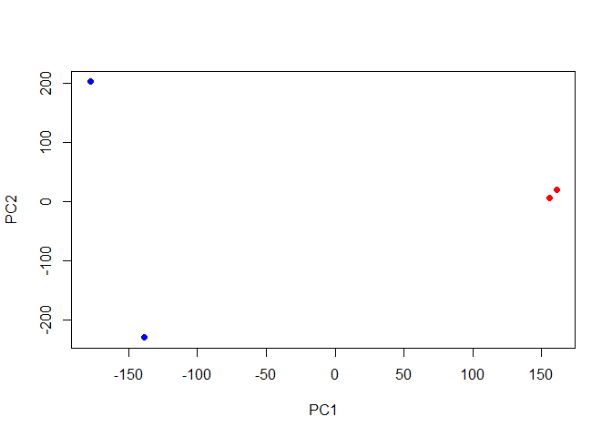
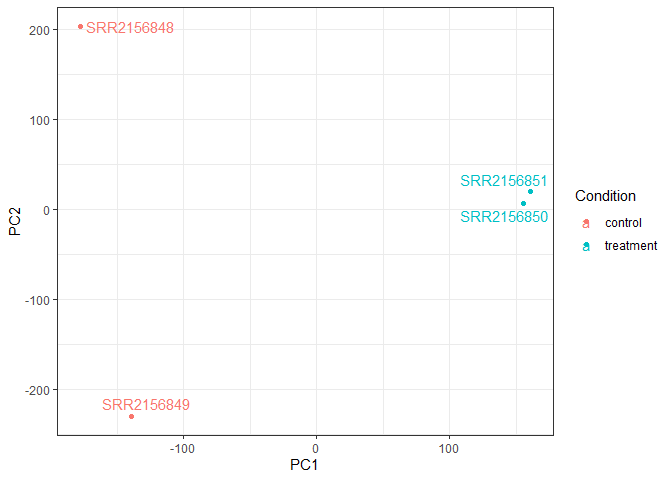

class16
================
Xueran Zou

# Import files

``` r
library(tximport)
library(rhdf5)

folders <- dir(pattern = "SRR21568")
samples <- sub("_quant", "", folders)
files <- file.path(folders, "abundance.h5")
names (files) <- samples

txi.kallisto <- tximport(files, type = "kallisto", txOut = TRUE)
```

    1 2 3 4 

``` r
head(txi.kallisto$counts)
```

                    SRR2156848 SRR2156849 SRR2156850 SRR2156851
    ENST00000539570          0          0    0.00000          0
    ENST00000576455          0          0    2.62037          0
    ENST00000510508          0          0    0.00000          0
    ENST00000474471          0          1    1.00000          0
    ENST00000381700          0          0    0.00000          0
    ENST00000445946          0          0    0.00000          0

``` r
colSums(txi.kallisto$counts)
```

    SRR2156848 SRR2156849 SRR2156850 SRR2156851 
       2563611    2600800    2372309    2111474 

``` r
sum(rowSums(txi.kallisto$counts)>0)
```

    [1] 94561

Filter out those annotated transcripts with no reads and those with no
change over the samples

``` r
to.keep <- rowSums(txi.kallisto$counts) > 0
kset.nonzero <- txi.kallisto$counts[to.keep,]
```

``` r
keep2 <- apply(kset.nonzero, 1, sd) > 0
x <- kset.nonzero[keep2,]
```

# Principal Component Analysis

``` r
pca <- prcomp(t(x), scale=TRUE)
```

``` r
summary(pca)
```

    Importance of components:
                                PC1      PC2      PC3   PC4
    Standard deviation     183.6379 177.3605 171.3020 1e+00
    Proportion of Variance   0.3568   0.3328   0.3104 1e-05
    Cumulative Proportion    0.3568   0.6895   1.0000 1e+00

Plot the results

``` r
plot(pca$x[,1], pca$x[,2], col=c("blue", "blue", "red", "red"), xlab="PC1", ylab="PC2", pch=16)
```



**Q.** Use ggplot to make a similar figure of PC1 vs PC2 and a seperate
figure PC1 vs PC3 and PC2 vs PC3.

``` r
library(ggplot2)
library(ggrepel)

colData <- data.frame(condition = factor(rep(c("control", "treatment"), each = 2)))
rownames(colData) <- colnames(txi.kallisto$counts)

y <- as.data.frame(pca$x)
y$Condition <- as.factor(colData$condition)

ggplot(y) +
  aes(PC1, PC2, col=Condition) +
  geom_point() +
  geom_text_repel(label=rownames(y)) +
  theme_bw()
```



# OPTIONAL: Differential-expression analysis

``` r
library(DESeq2)
```

    Loading required package: S4Vectors

    Loading required package: stats4

    Loading required package: BiocGenerics


    Attaching package: 'BiocGenerics'

    The following objects are masked from 'package:stats':

        IQR, mad, sd, var, xtabs

    The following objects are masked from 'package:base':

        anyDuplicated, aperm, append, as.data.frame, basename, cbind,
        colnames, dirname, do.call, duplicated, eval, evalq, Filter, Find,
        get, grep, grepl, intersect, is.unsorted, lapply, Map, mapply,
        match, mget, order, paste, pmax, pmax.int, pmin, pmin.int,
        Position, rank, rbind, Reduce, rownames, sapply, setdiff, sort,
        table, tapply, union, unique, unsplit, which.max, which.min


    Attaching package: 'S4Vectors'

    The following objects are masked from 'package:base':

        expand.grid, I, unname

    Loading required package: IRanges


    Attaching package: 'IRanges'

    The following object is masked from 'package:grDevices':

        windows

    Loading required package: GenomicRanges

    Loading required package: GenomeInfoDb

    Loading required package: SummarizedExperiment

    Loading required package: MatrixGenerics

    Loading required package: matrixStats


    Attaching package: 'MatrixGenerics'

    The following objects are masked from 'package:matrixStats':

        colAlls, colAnyNAs, colAnys, colAvgsPerRowSet, colCollapse,
        colCounts, colCummaxs, colCummins, colCumprods, colCumsums,
        colDiffs, colIQRDiffs, colIQRs, colLogSumExps, colMadDiffs,
        colMads, colMaxs, colMeans2, colMedians, colMins, colOrderStats,
        colProds, colQuantiles, colRanges, colRanks, colSdDiffs, colSds,
        colSums2, colTabulates, colVarDiffs, colVars, colWeightedMads,
        colWeightedMeans, colWeightedMedians, colWeightedSds,
        colWeightedVars, rowAlls, rowAnyNAs, rowAnys, rowAvgsPerColSet,
        rowCollapse, rowCounts, rowCummaxs, rowCummins, rowCumprods,
        rowCumsums, rowDiffs, rowIQRDiffs, rowIQRs, rowLogSumExps,
        rowMadDiffs, rowMads, rowMaxs, rowMeans2, rowMedians, rowMins,
        rowOrderStats, rowProds, rowQuantiles, rowRanges, rowRanks,
        rowSdDiffs, rowSds, rowSums2, rowTabulates, rowVarDiffs, rowVars,
        rowWeightedMads, rowWeightedMeans, rowWeightedMedians,
        rowWeightedSds, rowWeightedVars

    Loading required package: Biobase

    Welcome to Bioconductor

        Vignettes contain introductory material; view with
        'browseVignettes()'. To cite Bioconductor, see
        'citation("Biobase")', and for packages 'citation("pkgname")'.


    Attaching package: 'Biobase'

    The following object is masked from 'package:MatrixGenerics':

        rowMedians

    The following objects are masked from 'package:matrixStats':

        anyMissing, rowMedians

``` r
sampleTable <- data.frame(condition = factor(rep(c("control", "treatment"), each = 2)))
rownames(sampleTable) <- colnames(txi.kallisto$counts)
```

``` r
dds <- DESeqDataSetFromTximport(txi.kallisto,
                                sampleTable, 
                                ~condition)
```

    using counts and average transcript lengths from tximport

``` r
dds <- DESeq(dds)
```

    estimating size factors

    using 'avgTxLength' from assays(dds), correcting for library size

    estimating dispersions

    gene-wise dispersion estimates

    mean-dispersion relationship

    -- note: fitType='parametric', but the dispersion trend was not well captured by the
       function: y = a/x + b, and a local regression fit was automatically substituted.
       specify fitType='local' or 'mean' to avoid this message next time.

    final dispersion estimates

    fitting model and testing

``` r
res <- results(dds)
head(res)
```

    log2 fold change (MLE): condition treatment vs control 
    Wald test p-value: condition treatment vs control 
    DataFrame with 6 rows and 6 columns
                     baseMean log2FoldChange     lfcSE      stat    pvalue
                    <numeric>      <numeric> <numeric> <numeric> <numeric>
    ENST00000539570  0.000000             NA        NA        NA        NA
    ENST00000576455  0.761453       3.155061   4.86052 0.6491203  0.516261
    ENST00000510508  0.000000             NA        NA        NA        NA
    ENST00000474471  0.484938       0.181923   4.24871 0.0428185  0.965846
    ENST00000381700  0.000000             NA        NA        NA        NA
    ENST00000445946  0.000000             NA        NA        NA        NA
                         padj
                    <numeric>
    ENST00000539570        NA
    ENST00000576455        NA
    ENST00000510508        NA
    ENST00000474471        NA
    ENST00000381700        NA
    ENST00000445946        NA
