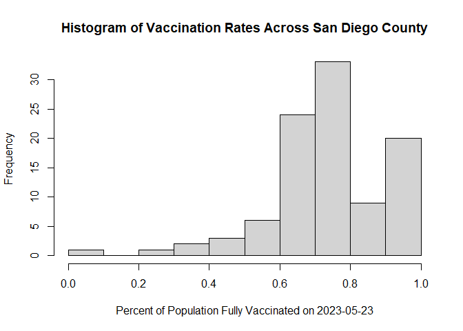
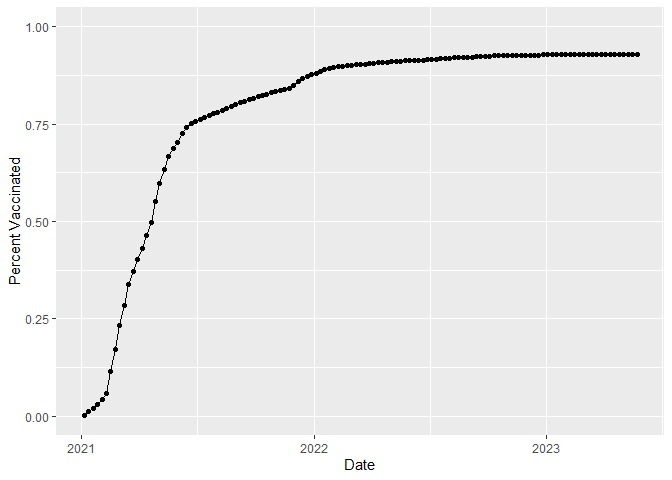
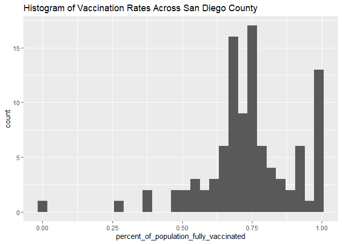
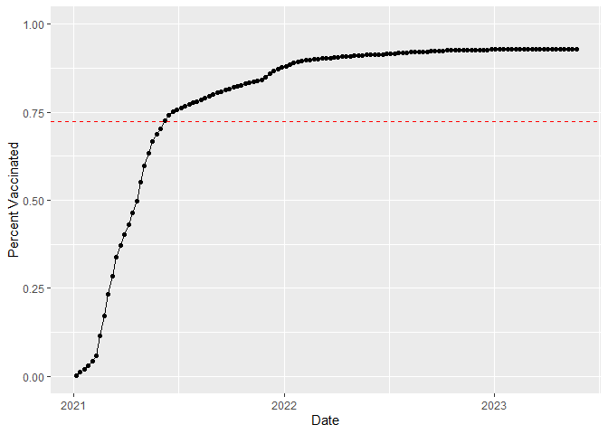
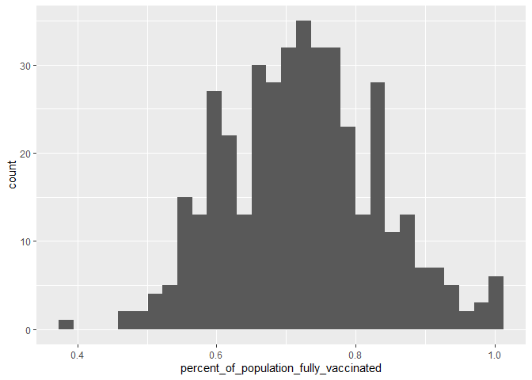
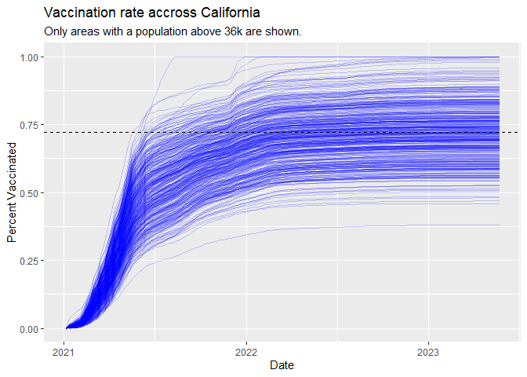

class17
================

# Getting started

``` r
vax <- read.csv("covid19vaccinesbyzipcode_test.csv")

head(vax)
```

      as_of_date zip_code_tabulation_area local_health_jurisdiction      county
    1 2021-01-05                    94579                   Alameda     Alameda
    2 2021-01-05                    93726                    Fresno      Fresno
    3 2021-01-05                    94305               Santa Clara Santa Clara
    4 2021-01-05                    93704                    Fresno      Fresno
    5 2021-01-05                    94403                 San Mateo   San Mateo
    6 2021-01-05                    93668                    Fresno      Fresno
      vaccine_equity_metric_quartile                 vem_source
    1                              3 Healthy Places Index Score
    2                              1 Healthy Places Index Score
    3                              4 Healthy Places Index Score
    4                              1 Healthy Places Index Score
    5                              4 Healthy Places Index Score
    6                              1    CDPH-Derived ZCTA Score
      age12_plus_population age5_plus_population tot_population
    1               19192.7                20872          21883
    2               33707.7                39067          42824
    3               15716.9                16015          16397
    4               24803.5                27701          29740
    5               37967.5                41530          44408
    6                1013.4                 1199           1219
      persons_fully_vaccinated persons_partially_vaccinated
    1                       NA                           NA
    2                       NA                           NA
    3                       NA                           NA
    4                       NA                           NA
    5                       NA                           NA
    6                       NA                           NA
      percent_of_population_fully_vaccinated
    1                                     NA
    2                                     NA
    3                                     NA
    4                                     NA
    5                                     NA
    6                                     NA
      percent_of_population_partially_vaccinated
    1                                         NA
    2                                         NA
    3                                         NA
    4                                         NA
    5                                         NA
    6                                         NA
      percent_of_population_with_1_plus_dose booster_recip_count
    1                                     NA                  NA
    2                                     NA                  NA
    3                                     NA                  NA
    4                                     NA                  NA
    5                                     NA                  NA
    6                                     NA                  NA
      bivalent_dose_recip_count eligible_recipient_count
    1                        NA                        4
    2                        NA                        2
    3                        NA                        8
    4                        NA                        5
    5                        NA                        7
    6                        NA                        0
      eligible_bivalent_recipient_count
    1                                 4
    2                                 2
    3                                 8
    4                                 5
    5                                 7
    6                                 0
                                                                   redacted
    1 Information redacted in accordance with CA state privacy requirements
    2 Information redacted in accordance with CA state privacy requirements
    3 Information redacted in accordance with CA state privacy requirements
    4 Information redacted in accordance with CA state privacy requirements
    5 Information redacted in accordance with CA state privacy requirements
    6 Information redacted in accordance with CA state privacy requirements

**Q1.** What column details the total number of people fully vaccinated?

persons_fully_vaccinated

**Q2.** What column details the Zip code tabulation area?

zip_code_tabulation_area

**Q3.** What is the earliest date in this dataset?

``` r
min(vax$as_of_date)
```

    [1] "2021-01-05"

**Q4.** What is the latest date in this dataset?

``` r
max(vax$as_of_date)
```

    [1] "2023-05-23"

``` r
skimr::skim_without_charts(vax)
```

|                                                  |        |
|:-------------------------------------------------|:-------|
| Name                                             | vax    |
| Number of rows                                   | 220500 |
| Number of columns                                | 19     |
| \_\_\_\_\_\_\_\_\_\_\_\_\_\_\_\_\_\_\_\_\_\_\_   |        |
| Column type frequency:                           |        |
| character                                        | 5      |
| numeric                                          | 14     |
| \_\_\_\_\_\_\_\_\_\_\_\_\_\_\_\_\_\_\_\_\_\_\_\_ |        |
| Group variables                                  | None   |

Data summary

**Variable type: character**

| skim_variable             | n_missing | complete_rate | min | max | empty | n_unique | whitespace |
|:--------------------------|----------:|--------------:|----:|----:|------:|---------:|-----------:|
| as_of_date                |         0 |             1 |  10 |  10 |     0 |      125 |          0 |
| local_health_jurisdiction |         0 |             1 |   0 |  15 |   625 |       62 |          0 |
| county                    |         0 |             1 |   0 |  15 |   625 |       59 |          0 |
| vem_source                |         0 |             1 |  15 |  26 |     0 |        3 |          0 |
| redacted                  |         0 |             1 |   2 |  69 |     0 |        2 |          0 |

**Variable type: numeric**

| skim_variable                              | n_missing | complete_rate |     mean |       sd |    p0 |      p25 |      p50 |      p75 |     p100 |
|:-------------------------------------------|----------:|--------------:|---------:|---------:|------:|---------:|---------:|---------:|---------:|
| zip_code_tabulation_area                   |         0 |          1.00 | 93665.11 |  1817.38 | 90001 | 92257.75 | 93658.50 | 95380.50 |  97635.0 |
| vaccine_equity_metric_quartile             |     10875 |          0.95 |     2.44 |     1.11 |     1 |     1.00 |     2.00 |     3.00 |      4.0 |
| age12_plus_population                      |         0 |          1.00 | 18895.04 | 18993.87 |     0 |  1346.95 | 13685.10 | 31756.12 |  88556.7 |
| age5_plus_population                       |         0 |          1.00 | 20875.24 | 21105.97 |     0 |  1460.50 | 15364.00 | 34877.00 | 101902.0 |
| tot_population                             |     10750 |          0.95 | 23372.77 | 22628.50 |    12 |  2126.00 | 18714.00 | 38168.00 | 111165.0 |
| persons_fully_vaccinated                   |     17711 |          0.92 | 14272.72 | 15264.17 |    11 |   954.00 |  8990.00 | 23782.00 |  87724.0 |
| persons_partially_vaccinated               |     17711 |          0.92 |  1711.05 |  2071.56 |    11 |   164.00 |  1203.00 |  2550.00 |  42259.0 |
| percent_of_population_fully_vaccinated     |     22579 |          0.90 |     0.58 |     0.25 |     0 |     0.44 |     0.62 |     0.75 |      1.0 |
| percent_of_population_partially_vaccinated |     22579 |          0.90 |     0.08 |     0.09 |     0 |     0.05 |     0.06 |     0.08 |      1.0 |
| percent_of_population_with_1\_plus_dose    |     23732 |          0.89 |     0.64 |     0.24 |     0 |     0.50 |     0.68 |     0.82 |      1.0 |
| booster_recip_count                        |     74388 |          0.66 |  6373.43 |  7751.70 |    11 |   328.00 |  3097.00 | 10274.00 |  60022.0 |
| bivalent_dose_recip_count                  |    159956 |          0.27 |  3407.91 |  4010.38 |    11 |   222.00 |  1832.00 |  5482.00 |  29484.0 |
| eligible_recipient_count                   |         0 |          1.00 | 13120.40 | 15126.17 |     0 |   534.00 |  6663.00 | 22517.25 |  87437.0 |
| eligible_bivalent_recipient_count          |         0 |          1.00 | 13016.51 | 15199.08 |     0 |   266.00 |  6562.00 | 22513.00 |  87437.0 |

**Q5.** How many numeric columns are in this dataset?

14

**Q6.** Note that there are “missing values” in the dataset. How many
`NA` values there in the `persons_fully_vaccinated` column?

``` r
na_pfv <- sum(is.na(vax$persons_fully_vaccinated))
na_pfv
```

    [1] 17711

**Q7.** What percent of `persons_fully_vaccinated` values are missing
(to 2 significant figures)?

``` r
na_pfv/nrow(vax) * 100
```

    [1] 8.0322

**Q8.** \[Optional\]: Why might this data be missing?

It might be because the data hasn’t been updated.

## Working with dates

``` r
library(lubridate)
```


    Attaching package: 'lubridate'

    The following objects are masked from 'package:base':

        date, intersect, setdiff, union

``` r
today()
```

    [1] "2023-06-09"

As the class of as_of_date column is character, we can’t do math with
it.

``` r
class(vax$as_of_date)
```

    [1] "character"

``` r
# This will give an error
# today() - vax$ax_of_date[1]
```

Convert our date date into a lubridate format things.

``` r
vax$as_of_date <- ymd(vax$as_of_date)
```

Now we can do math with dates.

``` r
today() - vax$as_of_date[1]
```

    Time difference of 885 days

Determine how many days the dataset span.

``` r
vax$as_of_date[nrow(vax)] - vax$as_of_date[1]
```

    Time difference of 868 days

**Q9.** How many days have passed since the last update of the dataset?

``` r
today() - vax$as_of_date[nrow(vax)]
```

    Time difference of 17 days

**Q10.** How many unique dates are in the dataset (i.e. how many
different dates are detailed)?

``` r
length(unique(vax$as_of_date))
```

    [1] 125

# Working with ZIP codes

``` r
library(zipcodeR)
```

    The legacy packages maptools, rgdal, and rgeos, underpinning this package
    will retire shortly. Please refer to R-spatial evolution reports on
    https://r-spatial.org/r/2023/05/15/evolution4.html for details.
    This package is now running under evolution status 0 

``` r
class(vax$zip_code_tabulation_area)
```

    [1] "integer"

``` r
geocode_zip('92037')
```

    # A tibble: 1 × 3
      zipcode   lat   lng
      <chr>   <dbl> <dbl>
    1 92037    32.8 -117.

Calculate the distance between the centroids of two zip codes in miles.

``` r
zip_distance('92037','92109')
```

      zipcode_a zipcode_b distance
    1     92037     92109     2.33

Pull census data about ZIP code areas.

``` r
reverse_zipcode(c('92037', '92109'))
```

    # A tibble: 2 × 24
      zipcode zipcode_type major_city post_office_city common_city_list county state
      <chr>   <chr>        <chr>      <chr>                      <blob> <chr>  <chr>
    1 92037   Standard     La Jolla   La Jolla, CA           <raw 20 B> San D… CA   
    2 92109   Standard     San Diego  San Diego, CA          <raw 21 B> San D… CA   
    # ℹ 17 more variables: lat <dbl>, lng <dbl>, timezone <chr>,
    #   radius_in_miles <dbl>, area_code_list <blob>, population <int>,
    #   population_density <dbl>, land_area_in_sqmi <dbl>,
    #   water_area_in_sqmi <dbl>, housing_units <int>,
    #   occupied_housing_units <int>, median_home_value <int>,
    #   median_household_income <int>, bounds_west <dbl>, bounds_east <dbl>,
    #   bounds_north <dbl>, bounds_south <dbl>

**OPTIONAL:** use reverse_zipcode() to pull census data later on for any
or all ZIP code areas we might be interested in.

``` r
# Pull data for all ZIP codes in the dataset
# zipdata <- reverse_zipcode(vax$zip_code_tabulation_area)
```

# Focus on the San Diego area

Subset to San Diego county only areas.

``` r
sd <- vax[vax$county == "San Diego", ]
```

Another way to do it.

``` r
# library(dplyr)
# sd <- filter(vax, county == "San Diego")
```

``` r
nrow(sd)
```

    [1] 13375

Using dplyr is often more convenient when we are subsetting across
multiple criteria.

``` r
# Subset to all San Diego county areas with a population of over 10000
# sd.10 <- filter(vax, county == "San Diego" & age5_plus_population > 10000)
```

**Q11.** How many distinct zip codes are listed for San Diego County?

``` r
length(unique(sd$zip_code_tabulation_area))
```

    [1] 107

**Q12.** What San Diego County Zip code area has the largest population
in this dataset?

``` r
sd$zip_code_tabulation_area[which.max(sd$tot_population)]
```

    [1] 92154

**Q13.** What is the overall average (with 2 decimal numbers) “Percent
of Population Fully Vaccinated” value for all San Diego “County” as of
“2023-05-23”?

``` r
library(dplyr)
```


    Attaching package: 'dplyr'

    The following objects are masked from 'package:stats':

        filter, lag

    The following objects are masked from 'package:base':

        intersect, setdiff, setequal, union

``` r
sd_filter <- sd %>%
  filter(county == "San Diego", as_of_date == "2023-05-23")

mean(sd_filter$percent_of_population_fully_vaccinated, na.rm = TRUE)
```

    [1] 0.7419654

**Q14.** Using either ggplot or base R graphics make a summary figure
that shows the distribution of Percent of Population Fully Vaccinated
values as of “2023-05-23”?

``` r
hist(sd_filter$percent_of_population_fully_vaccinated, xlab = "Percent of Population Fully Vaccinated on 2023-05-23", main = "Histogram of Vaccination Rates Across San Diego County")
```



## Focus on UCSD/La Jolla

``` r
ucsd <- filter(sd, zip_code_tabulation_area=="92037")
ucsd[1,]$age5_plus_population
```

    [1] 36144

**Q15**. Using **ggplot** make a graph of the vaccination rate time
course for the 92037 ZIP code area:

``` r
library(ggplot2)

ggplot(ucsd) +
  aes(x=as_of_date, y=percent_of_population_fully_vaccinated) +
  geom_point() +
  geom_line(group=1) +
  ylim(c(0,1)) +
  labs(x="Date", y="Percent Vaccinated")
```



ggplot

``` r
library(ggplot2)

ggplot(sd_filter) +
  aes(percent_of_population_fully_vaccinated) +
  geom_histogram() +
  ggtitle("Histogram of Vaccination Rates Across San Diego County")
```

    `stat_bin()` using `bins = 30`. Pick better value with `binwidth`.

    Warning: Removed 8 rows containing non-finite values (`stat_bin()`).



## Comparing to similar sized areas

``` r
vax.36 <- filter(vax, age5_plus_population > 36144 & as_of_date == "2023-05-23")

head(vax.36)
```

      as_of_date zip_code_tabulation_area local_health_jurisdiction       county
    1 2023-05-23                    93720                    Fresno       Fresno
    2 2023-05-23                    95670                Sacramento   Sacramento
    3 2023-05-23                    91405               Los Angeles  Los Angeles
    4 2023-05-23                    94582              Contra Costa Contra Costa
    5 2023-05-23                    95687                    Solano       Solano
    6 2023-05-23                    92627                    Orange       Orange
      vaccine_equity_metric_quartile                 vem_source
    1                              3 Healthy Places Index Score
    2                              2 Healthy Places Index Score
    3                              1 Healthy Places Index Score
    4                              4 Healthy Places Index Score
    5                              3 Healthy Places Index Score
    6                              2 Healthy Places Index Score
      age12_plus_population age5_plus_population tot_population
    1               40357.3                44412          47081
    2               46783.6                52133          55558
    3               46561.6                51961          55506
    4               34809.5                40433          42576
    5               59036.1                65398          69060
    6               54060.2                59229          63161
      persons_fully_vaccinated persons_partially_vaccinated
    1                    33810                         3122
    2                    35674                         3418
    3                    37040                         4832
    4                    44338                         3214
    5                    40549                         4178
    6                    40189                         3798
      percent_of_population_fully_vaccinated
    1                               0.718124
    2                               0.642104
    3                               0.667315
    4                               1.000000
    5                               0.587156
    6                               0.636295
      percent_of_population_partially_vaccinated
    1                                   0.066311
    2                                   0.061521
    3                                   0.087054
    4                                   0.075489
    5                                   0.060498
    6                                   0.060132
      percent_of_population_with_1_plus_dose booster_recip_count
    1                               0.784435               21186
    2                               0.703625               21712
    3                               0.754369               18988
    4                               1.000000               33971
    5                               0.647654               24494
    6                               0.696427               21494
      bivalent_dose_recip_count eligible_recipient_count
    1                      8056                    33740
    2                     10016                    35587
    3                      6688                    36977
    4                     16642                    44050
    5                     10308                    40460
    6                      7819                    40104
      eligible_bivalent_recipient_count redacted
    1                             33740       No
    2                             35587       No
    3                             36977       No
    4                             44050       No
    5                             40460       No
    6                             40104       No

**Q16**. Calculate the mean *“Percent of Population Fully Vaccinated”*
for ZIP code areas with a population as large as 92037 (La Jolla)
*as_of_date* “2023-05-23”. Add this as a straight horizontal line to
your plot from above with the `geom_hline()` function?

``` r
mean <- mean(vax.36$percent_of_population_fully_vaccinated)
mean
```

    [1] 0.7225892

``` r
ggplot(ucsd) +
  aes(x=as_of_date, y=percent_of_population_fully_vaccinated) +
  geom_point() +
  geom_line(group=1) +
  ylim(c(0,1)) +
  labs(x="Date", y="Percent Vaccinated") +
  geom_hline(yintercept = mean, col = 'red', linetype = 'dashed')
```



**Q17.** What is the 6 number summary (Min, 1st Qu., Median, Mean, 3rd
Qu., and Max) of the *“Percent of Population Fully Vaccinated”* values
for ZIP code areas with a population as large as 92037 (La Jolla)
*as_of_date* “2023-05-23”?

``` r
summary(vax.36)
```

       as_of_date         zip_code_tabulation_area local_health_jurisdiction
     Min.   :2023-05-23   Min.   :90001            Length:411               
     1st Qu.:2023-05-23   1st Qu.:91762            Class :character         
     Median :2023-05-23   Median :92646            Mode  :character         
     Mean   :2023-05-23   Mean   :92862                                     
     3rd Qu.:2023-05-23   3rd Qu.:94517                                     
     Max.   :2023-05-23   Max.   :96003                                     
        county          vaccine_equity_metric_quartile  vem_source       
     Length:411         Min.   :1.000                  Length:411        
     Class :character   1st Qu.:1.000                  Class :character  
     Mode  :character   Median :2.000                  Mode  :character  
                        Mean   :2.353                                    
                        3rd Qu.:3.000                                    
                        Max.   :4.000                                    
     age12_plus_population age5_plus_population tot_population  
     Min.   :31651         Min.   : 36181       Min.   : 38007  
     1st Qu.:37694         1st Qu.: 41613       1st Qu.: 44393  
     Median :43985         Median : 48573       Median : 52212  
     Mean   :46847         Mean   : 52012       Mean   : 55641  
     3rd Qu.:53932         3rd Qu.: 59168       3rd Qu.: 62910  
     Max.   :88557         Max.   :101902       Max.   :111165  
     persons_fully_vaccinated persons_partially_vaccinated
     Min.   :17565            Min.   : 1812               
     1st Qu.:32272            1st Qu.: 2956               
     Median :37303            Median : 3653               
     Mean   :40126            Mean   : 4272               
     3rd Qu.:45420            3rd Qu.: 4852               
     Max.   :87724            Max.   :40936               
     percent_of_population_fully_vaccinated
     Min.   :0.3816                        
     1st Qu.:0.6469                        
     Median :0.7207                        
     Mean   :0.7226                        
     3rd Qu.:0.7924                        
     Max.   :1.0000                        
     percent_of_population_partially_vaccinated
     Min.   :0.04471                           
     1st Qu.:0.05943                           
     Median :0.06763                           
     Mean   :0.07668                           
     3rd Qu.:0.07978                           
     Max.   :1.00000                           
     percent_of_population_with_1_plus_dose booster_recip_count
     Min.   :0.4473                         Min.   : 9144      
     1st Qu.:0.7148                         1st Qu.:18088      
     Median :0.7907                         Median :22785      
     Mean   :0.7927                         Mean   :24117      
     3rd Qu.:0.8708                         3rd Qu.:28821      
     Max.   :1.0000                         Max.   :60022      
     bivalent_dose_recip_count eligible_recipient_count
     Min.   : 2946             Min.   :17492           
     1st Qu.: 6228             1st Qu.:32166           
     Median : 8684             Median :37221           
     Mean   : 9639             Mean   :40009           
     3rd Qu.:12214             3rd Qu.:45303           
     Max.   :29484             Max.   :87437           
     eligible_bivalent_recipient_count   redacted        
     Min.   :    0                     Length:411        
     1st Qu.:32034                     Class :character  
     Median :37166                     Mode  :character  
     Mean   :39679                                       
     3rd Qu.:45303                                       
     Max.   :87437                                       

**Q18.** Using ggplot generate a histogram of this data.

``` r
library(ggplot2)

ggplot(vax.36, na.rm=TRUE) +
  aes(x=percent_of_population_fully_vaccinated) +
  geom_histogram()
```

    `stat_bin()` using `bins = 30`. Pick better value with `binwidth`.



**Q19**. Is the 92109 and 92040 ZIP code areas above or below the
average value you calculated for all these above?

``` r
vax_92109 <- vax %>% filter(as_of_date == "2023-05-23") %>%  
  filter(zip_code_tabulation_area=="92109") %>%
  select(percent_of_population_fully_vaccinated)

vax_92040 <- vax %>% filter(as_of_date == "2023-05-23") %>%  
  filter(zip_code_tabulation_area=="92040") %>%
  select(percent_of_population_fully_vaccinated)

vax_92109$percent_of_population_fully_vaccinated > mean
```

    [1] FALSE

``` r
vax_92040$percent_of_population_fully_vaccinated > mean
```

    [1] FALSE

**Q20.** Finally make a time course plot of vaccination progress for all
areas in the full dataset with a `age5_plus_population > 36144`.

``` r
vax.36.all <- filter(vax, age5_plus_population > 36144)
```

``` r
ggplot(vax.36.all) +
  aes(as_of_date, percent_of_population_fully_vaccinated, group=zip_code_tabulation_area) +
  geom_line(alpha=0.2, color='blue') +
  ylim(c(0,1)) +
  labs(x='Date', y='Percent Vaccinated', title="Vaccination rate accross California", subtitle="Only areas with a population above 36k are shown.") +
  geom_hline(yintercept=mean, linetype='dashed')
```

    Warning: Removed 185 rows containing missing values (`geom_line()`).


